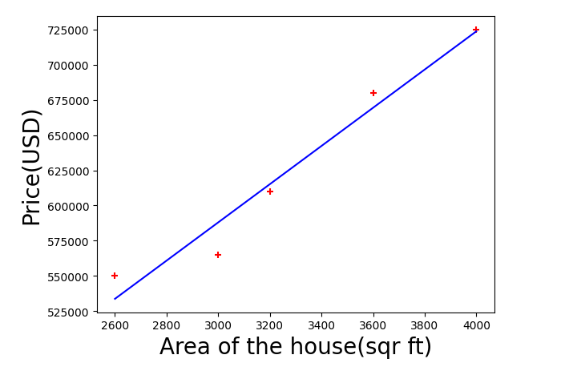
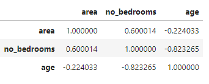
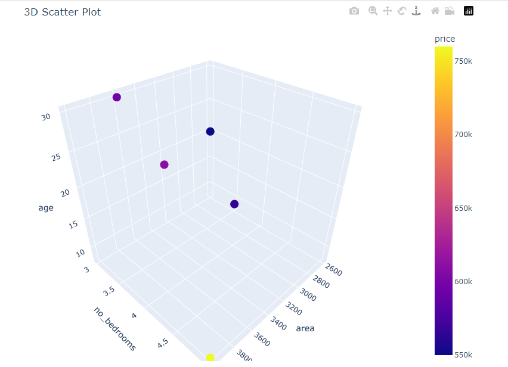

# Simple Linear Regression 
## Objective
My aim is to predict house prices of new areas of houses based on the data I have.

# (a) Having one independent variable; $$\hat{y} = mx + b$$
## Data Collection 

I have a [dataset](Assets/house_price.csv) in csv format which has **5** rows and **2** columns;
- 1st column consists the areas.(independent variable)
- 2nd column consists the prices of the houses.(dependent variable)
  
## EDA (Exploratory Data Analysis)
First, load the dataset to be used into jupyter notebook;

```python
import pandas as pd
df = pd.read_csv(r'file_path.csv')
df.head()
```

Confirm the shape of dataset;

```python
df.shape
```
Descriptive statistics such as mean, median, max, min;

```python
df.describe()
```
### Visualization
Plot the area against price;

```python
import matplotlib.pyplot as plt
plt.xlabel('Area', fontsize=20)
plt.ylabel('Price (USD), fontsize=20)
plt.scatter(df['area'], df['price'], marker='+', color='red')
plt. plot(df['area'], reg.predict(df[['area']]), color = 'blue') # added after model development
```



## Model Development 

```python
from sklearn.linear_model import LinearRegression
reg=LinearRegression()
reg.fit(df[['area']],df['price']) #train the model
```

Predict prices to check accuracy of the model;

```python
import numpy as np
areas = df[['area']]

def predict_for_areas(start_area, end_area):
areas = np.arange(start_area, end_area+1).reshape(-1,1)

df['predicted price'] = reg.predict(areas)
df
```

Compute Mean Squared Error;

```python
from sklearn.metrics import mean_squared_error
actual = df['price']
pred = df['predicted price']
MSE = mean_squared_error(actual,pred)
MSE
```

## Model interpretation
- Having a Root Mean Squared Error(RMSE) of
  
```python
from sklearn.metrics import root_mean_squared_error
RMSE = root_mean_squared_error(actual,pred)
RMSE
```

**13668.030893042014**, this means the average error in predictions is about $13,668.

Since the prices are in hundreds of thousands, an RMSE of about $13,668 is acceptable.

Concludes that the model is applicable.

y = mx+b 
- y = represents the price of the house(dependent)
- m = coefficient
- x = represents the area of the house(independent) 
- b = intercept

Compute the intercept and coefficient;

```python
reg.intercept_
```

```python
reg.coef_
```

- Having a positive _coefficient_ of **135.78767123**, means that as the area of house increase by one square feet, the predicted price of house increases approximately by $135.79

- Having an _intercept_ of **180616.43835616432**, means that when the area of the house is 0, the predicted price of house is approximately $180616.44

  - In practical terms, this might not make sense, as a house with an area of zero square feet does not exist. However, the intercept is crucial for the mathematical formulation of the regression line.


# (b) Having more than one variable (y = m1x1 + m2x2 + m3x3 + ... + b)

## Data collection 
For this case, I have a [dataset](Assets/House_prices_multi.csv) with **5** rows and **4** columns;

- Columns:
    - area: area of the house in square feet.
    - no_bedrooms: number of bedrooms in a particular house.
    - age: number of years that the house has covered.
    - price: actual price of the house.(only dependent variable)

## Data cleaning
Loaded the data into the IDE just like the case above.

My data appeared to have a missing value on the _no_bedrooms_ column.

I opted to replace with the median of the column:

```python
import math
median = math.floor(df['no_bedrooms'].median()) # generate an integer
median
```
Median = 3 

Time to replace: 

```python
df['no_bedrooms'] = df['no_bedrooms'].fillna(median)
df
```
## EDA 
Confirm shape: 

```python
df.shape
```

Check correlation: 

```python
df.drop('price',axis=1)
df.corr()
```


Multicollinearity means that 2 or more independent variables correlate strongly with each other.

It's evident that the independent variables have strong correlation.

Since the aim is only to predict the price(How good the prediction is), this might not affect. 


### Visualization 

```python
import plotly.express as px
fig = px.scatter_3d(df, x='area', y='no_bedrooms', z='age', color='price', title='3D Scatter Plot')

fig.update_layout(
width=800,
height=600,
margin=dict(l=0,r=0,b=0,t=40))

fig.show()
```



## Model development 

```python
from sklearn.linear_model import LinearRegression
reg=LinearRegression()
reg.fit(df[['area','no_bedrooms','age']],df['price'])
```

Execute the predictions: 

```python
df_pred=df.drop('price',axis=1)
df['predicted price']=reg.predict(df_pred)
df
```

Calculate RMSE to see whether the model is performing well: 

```python
from sklearn.metrics import root_mean_squared_error
actual_price=df['price']
predicted_price=df['predicted price']
error=root_mean_squared_error (actual_price,predicted_price)
error
```

Calculate relative error of RMSE which helps to interpret the error in a more intuitive way: 

Relative error = RMSE / mean of the actual prices

```python
import numpy as np
y=df['price']
mean_actual_price=np.mean(y)

(RMSE / mean_actual_price) × 100
```

Check coefficients and intercept: 

## Model interpretation 

Since we have multicollinearity in our independent variables, this instability makes it difficult to determine the true effect of each independent variable on the dependent variable which is the price. 

In short, the coefficients can't be interpreted meaningfully.

But there are several ways to deal with the multicollinearity such as removing highly correlated ind. variables, combining them, or use regularization methods; Ridge and Lasso.
